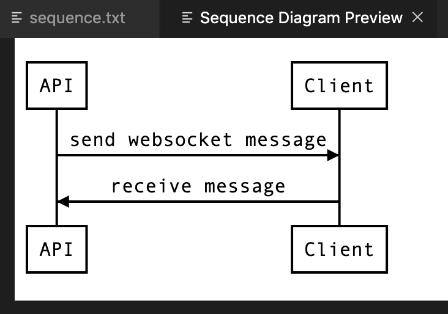

# js-sequence-diagram-code

A Visual Studio Code extension to render [js-sequence-diagrams](https://github.com/bramp/js-sequence-diagrams).

## Features

Adds a command `Sequence Diagram Preview` to your command palette.

## Requirements

None

## Extension Settings

None

## Known Issues

- Diagrams which are too wide will overflow outside of the iframe that VSCode provides
- Can't use `title` or `participants` at the top of your sequence, just start with your sequence definitions

## Release Notes

### 1.0.0
Initial release. Works.

-----------------------------------------------------------------------------------------------------------

**Enjoy!**

Thanks to the author(s) of js-sequence-diagrams

